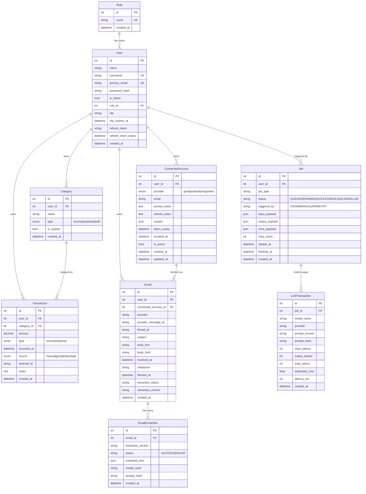

# 🗄️ Database Schema

## Entity Relationship Diagram

---

## Models Reference

### Role
- **Table**: `roles`
- **Purpose**: RBAC — defines user permissions
- **Key values**: `"admin"`, `"user"`
- **Relationship**: One-to-many with `User`

### User
- **Table**: `users`
- **Purpose**: Core user entity with authentication data
- **Unique constraints**: `username`, `primary_email`
- **Auth fields**: `password_hash` (bcrypt), `otp` + `otp_expires_at` (password reset), `refresh_token` + `refresh_token_expiry`
- **Cascade relationships**: Categories, Transactions, ConnectedAccounts, Emails

### Category
- **Table**: `categories`
- **Purpose**: User-defined category for organizing transactions
- **Types**: `income`, `expense`, `both`
- **Unique constraint**: `(user_id, name)` — no duplicate category names per user
- **Special**: `is_system` flag for system-generated categories

### Transaction
- **Table**: `transactions`
- **Purpose**: Financial transaction records
- **Amount**: `Numeric(12, 2)` for precise currency values
- **Source tracking**: `manual`, `gmail`, `import`, `api`
- **Composite index**: `(user_id, occurred_at)` for efficient date-range queries
- **FK behavior**: `user_id` → CASCADE, `category_id` → SET NULL

### ConnectedAccount
- **Table**: `connected_accounts`
- **Purpose**: OAuth tokens for external email providers
- **Providers**: `gmail`, `outlook`, `imap`, `other`
- **Unique constraint**: `(provider, email)` — one connection per provider-email pair
- **Token management**: Stores encrypted `access_token`, `refresh_token`, `scopes`, `token_expiry`

### Email
- **Table**: `emails`
- **Purpose**: Fetched email messages from connected accounts
- **Deduplication**: `(provider, provider_message_id)` unique constraint
- **Processing status**: `PENDING` → `COMPLETED` | `FAILED`

### EmailExtraction
- **Table**: `email_extractions`
- **Purpose**: LLM extraction results from processed emails
- **Status values**: `SUCCESS`, `FAILED`, `SKIPPED`
- **Audit fields**: `model_used`, `prompt_hash`, `extraction_version`

### Job
- **Table**: `jobs`
- **Purpose**: Background job tracking and auditing
- **Job types**: `EMAIL_FETCH`, `EMAIL_EXTRACTION`, `EMAIL_REPROCESS`
- **Status lifecycle**: `QUEUED` → `RUNNING` → `SUCCESS` | `FAILED` | `CANCELLED`
- **Payload fields**: `input_payload`, `output_payload`, `error_payload` (all JSON)

### LLMTransaction
- **Table**: `llm_transactions`
- **Purpose**: Cost and usage tracking for LLM API calls
- **Metrics**: `input_tokens`, `output_tokens`, `total_tokens`, `estimated_cost`, `latency_ms`
- **Linked to jobs**: Each LLM call is associated with the parent job

---

## Migration History

| Migration | Description |
|-----------|-------------|
| `8dfa102f486c` | Initial migration (users table) |
| `18145c22048e` | Auth-related models (roles) |
| `ded1b14398dd` | Added `name` field to User model |
| `0ac2ec6c313d` | Modified User model |
| `324713d6732f` | Added OTP columns to User model |
| `d0ee78d7dc0d` | Categories, connected accounts |
| `9257d9f8cc12` | Email and Job models |
| `dfca4bea8251` | Consolidate connected accounts |
| `65c81b7d03ba` | Added `user_id` to jobs |
